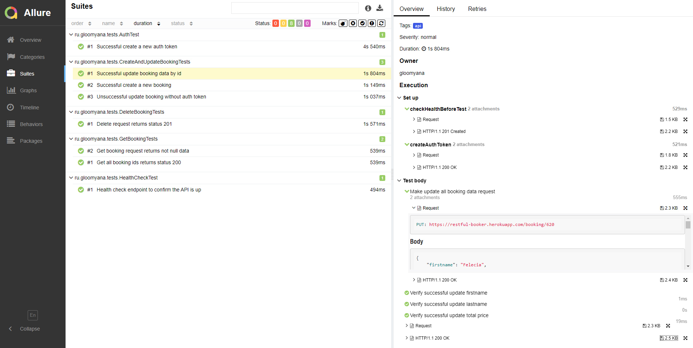
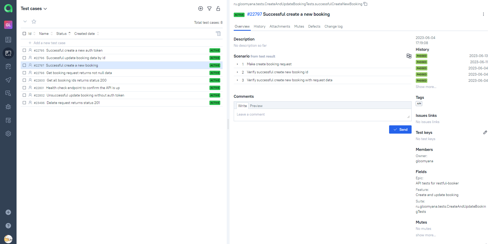

# [Restful-booker](https://restful-booker.herokuapp.com/) API automation project
</div>

##  <a name="contents">:page_facing_up: Сontents</a>
- [Tools and technologies](#hammer_and_wrench-tools-and-technologies)
- [Test cases](#white_check_mark-test-cases)
- [How to run](#arrow_forward-how-to-run)
- [Test results report in Allure Report](#-test-results-report-in-allure-report)
- [Allure TestOps integration](#-allure-testops-integration)
- [Telegram notifications](#-telegram-notifications)

## :hammer_and_wrench: Tools and technologies
<a href="https://www.jetbrains.com/idea/"></a>
<a href="https://www.java.com"></a>
<a href="https://junit.org/junit5"></a>
<a href="https://gradle.org"></a>
<a href="https://rest-assured.io"></a>
<a href="https://www.jenkins.io"></a>
<a href="https://qameta.io/allure-report"></a>
<a href="https://qameta.io"></a>
<a href="https://web.telegram.org/"></a> 

## :white_check_mark: Test cases
- [x] Successful create a new auth token
- [x] Successful update all booking data by id
- [x] Successful create a new booking
- [x] Get booking request returns not null data
- [x] Delete request returns status 200
- [x] Get all booking ids returns status 200
- [x] Health check endpoint to confirm API is up

## :arrow_forward: How to run
To run tests locally and in [Jenkins](https://jenkins.autotests.cloud/job/gloomyana-restful-booker-API/) the following gradle command is used:
```bash
$ gradle clean test 
```

 
After the build is done the test results are available in `Allure Report` and `Allure TestOps`
 

[back to Contents ⬆](#contents)

##  Test results report in [Allure Report](https://jenkins.autotests.cloud/job/gloomyana-restful-booker-API/allure/)
### Overview page

Overview page of Allure report contains the following parts:
>- **ALLURE REPORT** displays date and time of the test, overall number of launched tests and chart showing the percentage and number of successful, fallen and broken tests
>- **SUITES** displays groups of tests that share a common context such as a specific test environment or a particular test category
>- **FEATURES** displays groups of tests according to Epic, Feature tags
>- **TREND** displays trend of running tests for all runs
>- **CATEGORIES** displays distribution of unsuccessful tests by defect types
>- **EXECUTORS** displays information on test executors that were used to run the tests


### Graphs page
Graphs allow to see different statistics collected from the test data: statuses breakdown or severity and duration diagrams.


### Suites page
On the **SUITES** tab a standard structural representation of the executed tests, grouped by suites and classes can be found.
Each test case have information such as `severity`, `description`, `duration`, `test data` and execution `steps`.



[back to Contents ⬆](#contents)

##  [Allure TestOps](https://allure.autotests.cloud/project/3221/dashboards) integration
### Dashboards


### Test cases


[back to Contents ⬆](#contents)

##  Telegram notifications

**Telegram bot** sends a report to a specified telegram chat by results of each project build.

<p align="center">
</p>

[back to Contents ⬆](#contents)
